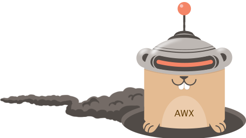

你好！
很冒昧用这样的方式来和你沟通，如有打扰请忽略我的提交哈。我是光年实验室（gnlab.com）的HR，在招Golang开发工程师，我们是一个技术型团队，技术氛围非常好。全职和兼职都可以，不过最好是全职，工作地点杭州。
我们公司是做流量增长的，Golang负责开发SAAS平台的应用，我们做的很多应用是全新的，工作非常有挑战也很有意思，是国内很多大厂的顾问。
如果有兴趣的话加我微信：13515810775  ，也可以访问 https://gnlab.com/，联系客服转发给HR。
# awx-go

[](https://travis-ci.org/Colstuwjx/awx-go)
[](https://goreportcard.com/report/github.com/Colstuwjx/awx-go)
[](https://codecov.io/gh/Colstuwjx/awx-go)

AWX SDK for the Go programming language.



## Installing

If you are using Go 1.5 with the GO15VENDOREXPERIMENT=1 vendoring flag, or 1.6 and higher you can use the following command to retrieve the SDK. The SDK will be included.

```
go get -u github.com/Colstuwjx/awx-go
```

## Example

We can simply import awx-go and call its services, such as PingService:

```
import (
    "log"
    awxGo "github.com/Colstuwjx/awx-go"
)

func main() {
    awx := awxGo.NewAWX("http://awx.your_server_host.com", "your_awx_username", "your_awx_passwd", nil)
    result, err := awx.PingService.Ping()
    if err != nil {
        log.Fatalf("Ping awx err: %s", err)
    }

    log.Println("Ping awx: ", result)
}
```

More examples can be found at [here](https://github.com/Colstuwjx/awx-go/tree/master/examples).

## Roadmap

awx-go is still in development, and its roadmap could be found at [here](https://github.com/Colstuwjx/awx-go/blob/master/ROADMAP.md).

## Contribute

There are many ways to contribute to awx-go.

* Submit bugs via [Github issues](https://github.com/Colstuwjx/awx-go/issues);
* Submit a [pull request](https://github.com/Colstuwjx/awx-go/pulls) for fixes or features;
* Mail [me](mailto:wjx_colstu@hotmail.com)
